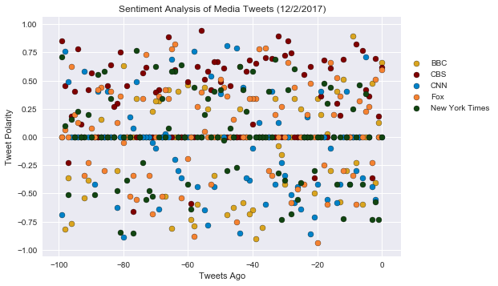

## Observations
 - CBS has the most positive tweets
 - CNN had a cluster of negative tweets between 40 and 60 tweets ago
 - The New York Times has had mostly neutral tweets


```python
# Dependencies
import pandas as pd
import os
import tweepy
import json
import matplotlib.pyplot as plt
import datetime

# Import and Initialize Sentiment Analyzer
from vaderSentiment.vaderSentiment import SentimentIntensityAnalyzer
analyzer = SentimentIntensityAnalyzer()

# Twitter API Keys
from config import twitter_keys
consumer_key = twitter_keys['consumer_key']
consumer_secret = twitter_keys['consumer_secret']
access_token = twitter_keys['access_token']
access_token_secret = twitter_keys['access_token_secret']

# Setup Tweepy API Authentication
auth = tweepy.OAuthHandler(consumer_key, consumer_secret)
auth.set_access_token(access_token, access_token_secret)
api = tweepy.API(auth, parser=tweepy.parsers.JSONParser())
```

Your final output should provide a visualized summary of the sentiments expressed in Tweets sent out by the following news organizations: __BBC, CBS, CNN, Fox, and New York times__.


```python
twitter_handle_dict = {'BBC': '@BBCNews',
                       'CBS': '@CBS',
                       'CNN': '@CNN',
                       'Fox': '@FoxNews',
                       'New York Times': '@nytimes'}
```

Pull last 100 tweets from each outlet.

Perform a sentiment analysis with the compound, positive, neutral, and negative scoring for each tweet. 

Pull into a DataFrame the tweet's source a count, its text, its date, and its compound, positive, neutral, and negative sentiment scores.

Export the data in the DataFrame into a CSV file.


```python
outlets_list = twitter_handle_dict.keys()

# Variables for holding sentiments
outlet_list = []
tweets_ago_list = []
tweet_list = []
date_list = []
compound_list = []
positive_list = []
negative_list = []
neutral_list = []

now = datetime.datetime.now()
date_string = f'{now.month}/{now.day}/{now.year}'
for outlet in outlets_list:
    target_user = twitter_handle_dict[outlet]
    outlet_tweet_count = 1
    public_tweets = api.user_timeline(screen_name=target_user, count=100)
    # Loop through all tweets
    for tweet_data in public_tweets:
        outlet_tweet_count -= 1
        tweet = tweet_data['text']
        date = tweet_data['created_at']
        # Run Vader Analysis on each tweet
        sentiment = analyzer.polarity_scores(tweet)
        # Add each value to the appropriate list
        outlet_list.append(outlet)
        tweets_ago_list.append(outlet_tweet_count)
        tweet_list.append(tweet)
        date_list.append(date)
        compound_list.append(sentiment['compound'])
        positive_list.append(sentiment['pos'])
        neutral_list.append(sentiment['neu'])
        negative_list.append(sentiment['neg'])
tweets_dict = {'outlet': outlet_list,
               'tweets_ago': tweets_ago_list,
               'text': tweet_list,
               'date': date_list,
               'compound': compound_list,
               'positive': positive_list,
               'neutral': neutral_list,
               'negative': negative_list}
tweets_df = pd.DataFrame(tweets_dict)
tweets_df = tweets_df[['outlet', 'tweets_ago', 'text', 'date', 'compound',
                       'positive', 'neutral',  'negative']]      
        
        
['count', 'text', 'date', 'compound', 'positive', 'neutral',  'negative']        
tweets_df.to_csv('tweet_sentiment.csv', index=False)
tweets_df
```


<div>
<style>
    .dataframe thead tr:only-child th {
        text-align: right;
    }

    .dataframe thead th {
        text-align: left;
    }

    .dataframe tbody tr th {
        vertical-align: top;
    }
</style>
<table border="1" class="dataframe">
  <thead>
    <tr style="text-align: right;">
      <th></th>
      <th>outlet</th>
      <th>tweets_ago</th>
      <th>text</th>
      <th>date</th>
      <th>compound</th>
      <th>positive</th>
      <th>neutral</th>
      <th>negative</th>
    </tr>
  </thead>
  <tbody>
    <tr>
      <th>0</th>
      <td>BBC</td>
      <td>0</td>
      <td>Pledge to boost mental health support in schoo...</td>
      <td>Sun Dec 03 00:53:43 +0000 2017</td>
      <td>0.6597</td>
      <td>0.435</td>
      <td>0.565</td>
      <td>0.000</td>
    </tr>
    <tr>
      <th>1</th>
      <td>BBC</td>
      <td>-1</td>
      <td>Social mobility board quits over lack of progr...</td>
      <td>Sat Dec 02 22:55:32 +0000 2017</td>
      <td>0.1280</td>
      <td>0.231</td>
      <td>0.579</td>
      <td>0.190</td>
    </tr>
    <tr>
      <th>2</th>
      <td>BBC</td>
      <td>-2</td>
      <td>Dalston bus ticket clash: Eight police officer...</td>
      <td>Sat Dec 02 19:03:17 +0000 2017</td>
      <td>-0.4019</td>
      <td>0.000</td>
      <td>0.748</td>
      <td>0.252</td>
    </tr>
    <tr>
      <th>3</th>
      <td>BBC</td>
      <td>-3</td>
      <td>Children's commissioner may consider legal act...</td>
      <td>Sat Dec 02 18:53:04 +0000 2017</td>
      <td>0.4767</td>
      <td>0.339</td>
      <td>0.661</td>
      <td>0.000</td>
    </tr>
    <tr>
      <th>4</th>
      <td>BBC</td>
      <td>-4</td>
      <td>RT @BBCSport: Half an hour gone.\n\nArsenal 0-...</td>
      <td>Sat Dec 02 18:01:06 +0000 2017</td>
      <td>0.0000</td>
      <td>0.000</td>
      <td>1.000</td>
      <td>0.000</td>
    </tr>
    <tr>
      <th>5</th>
      <td>BBC</td>
      <td>-5</td>
      <td>RT @bbcweather: Heading out this #SaturdayNigh...</td>
      <td>Sat Dec 02 17:53:21 +0000 2017</td>
      <td>0.0000</td>
      <td>0.000</td>
      <td>1.000</td>
      <td>0.000</td>
    </tr>
    <tr>
      <th>6</th>
      <td>BBC</td>
      <td>-6</td>
      <td>RT @BBCNewsbeat: The family of 14-year-old Sam...</td>
      <td>Sat Dec 02 17:28:39 +0000 2017</td>
      <td>-0.5994</td>
      <td>0.000</td>
      <td>0.804</td>
      <td>0.196</td>
    </tr>
    <tr>
      <th>7</th>
      <td>BBC</td>
      <td>-7</td>
      <td>RT @BBCSport: What a story for Hereford FC - t...</td>
      <td>Sat Dec 02 17:02:29 +0000 2017</td>
      <td>0.0000</td>
      <td>0.000</td>
      <td>1.000</td>
      <td>0.000</td>
    </tr>
    <tr>
      <th>8</th>
      <td>BBC</td>
      <td>-8</td>
      <td>RT @BBCNewsbeat: Tangled tinsel and wonky tree...</td>
      <td>Sat Dec 02 16:55:38 +0000 2017</td>
      <td>-0.2263</td>
      <td>0.000</td>
      <td>0.899</td>
      <td>0.101</td>
    </tr>
    <tr>
      <th>9</th>
      <td>BBC</td>
      <td>-9</td>
      <td>RT @BBCSport: Wales survived a remarkable come...</td>
      <td>Sat Dec 02 16:48:36 +0000 2017</td>
      <td>0.8934</td>
      <td>0.416</td>
      <td>0.584</td>
      <td>0.000</td>
    </tr>
    <tr>
      <th>10</th>
      <td>BBC</td>
      <td>-10</td>
      <td>RT @BBCSport: Here are the half-time Premier L...</td>
      <td>Sat Dec 02 15:57:36 +0000 2017</td>
      <td>0.0000</td>
      <td>0.000</td>
      <td>1.000</td>
      <td>0.000</td>
    </tr>
    <tr>
      <th>11</th>
      <td>BBC</td>
      <td>-11</td>
      <td>RT @BBCNewsbeat: Motorway Martin: PC single-ha...</td>
      <td>Sat Dec 02 15:29:08 +0000 2017</td>
      <td>-0.2960</td>
      <td>0.000</td>
      <td>0.789</td>
      <td>0.211</td>
    </tr>
    <tr>
      <th>12</th>
      <td>BBC</td>
      <td>-12</td>
      <td>Barclays axes free Kaspersky product as a 'pre...</td>
      <td>Sat Dec 02 15:02:01 +0000 2017</td>
      <td>0.5106</td>
      <td>0.320</td>
      <td>0.680</td>
      <td>0.000</td>
    </tr>
    <tr>
      <th>13</th>
      <td>BBC</td>
      <td>-13</td>
      <td>Whirlpool tumble dryers: MPs' anger as replace...</td>
      <td>Sat Dec 02 14:28:13 +0000 2017</td>
      <td>-0.5719</td>
      <td>0.000</td>
      <td>0.684</td>
      <td>0.316</td>
    </tr>
    <tr>
      <th>14</th>
      <td>BBC</td>
      <td>-14</td>
      <td>Chief vet defends support of larger hen cages ...</td>
      <td>Sat Dec 02 14:03:52 +0000 2017</td>
      <td>0.4019</td>
      <td>0.252</td>
      <td>0.748</td>
      <td>0.000</td>
    </tr>
    <tr>
      <th>15</th>
      <td>BBC</td>
      <td>-15</td>
      <td>RT @BBCScienceNews: Migraine is 'not just a he...</td>
      <td>Sat Dec 02 13:57:30 +0000 2017</td>
      <td>0.0000</td>
      <td>0.000</td>
      <td>1.000</td>
      <td>0.000</td>
    </tr>
    <tr>
      <th>16</th>
      <td>BBC</td>
      <td>-16</td>
      <td>Motorway PC stops lorry from falling off bridg...</td>
      <td>Sat Dec 02 12:40:53 +0000 2017</td>
      <td>-0.2960</td>
      <td>0.000</td>
      <td>0.686</td>
      <td>0.314</td>
    </tr>
    <tr>
      <th>17</th>
      <td>BBC</td>
      <td>-17</td>
      <td>RT @bbcstories: Errol’s a mechanic and prostat...</td>
      <td>Sat Dec 02 12:40:52 +0000 2017</td>
      <td>0.0258</td>
      <td>0.190</td>
      <td>0.657</td>
      <td>0.152</td>
    </tr>
    <tr>
      <th>18</th>
      <td>BBC</td>
      <td>-18</td>
      <td>Boy, 14, dies after being hit on M67 in Hyde h...</td>
      <td>Sat Dec 02 12:23:57 +0000 2017</td>
      <td>0.0000</td>
      <td>0.000</td>
      <td>1.000</td>
      <td>0.000</td>
    </tr>
    <tr>
      <th>19</th>
      <td>BBC</td>
      <td>-19</td>
      <td>Ashes: Australia on top after day one of secon...</td>
      <td>Sat Dec 02 12:03:23 +0000 2017</td>
      <td>0.2023</td>
      <td>0.130</td>
      <td>0.870</td>
      <td>0.000</td>
    </tr>
    <tr>
      <th>20</th>
      <td>BBC</td>
      <td>-20</td>
      <td>RT @5liveSport: That's close of play for Day 1...</td>
      <td>Sat Dec 02 11:54:26 +0000 2017</td>
      <td>0.3400</td>
      <td>0.107</td>
      <td>0.893</td>
      <td>0.000</td>
    </tr>
    <tr>
      <th>21</th>
      <td>BBC</td>
      <td>-21</td>
      <td>RT @Moneybox: Do we still need cash machines? ...</td>
      <td>Sat Dec 02 11:40:36 +0000 2017</td>
      <td>-0.4939</td>
      <td>0.000</td>
      <td>0.887</td>
      <td>0.113</td>
    </tr>
    <tr>
      <th>22</th>
      <td>BBC</td>
      <td>-22</td>
      <td>RT @BBCBusiness: What do unicorns, zebras, sha...</td>
      <td>Sat Dec 02 11:31:35 +0000 2017</td>
      <td>0.0000</td>
      <td>0.000</td>
      <td>1.000</td>
      <td>0.000</td>
    </tr>
    <tr>
      <th>23</th>
      <td>BBC</td>
      <td>-23</td>
      <td>New heart for eight-week-old Charlie Douthwait...</td>
      <td>Sat Dec 02 11:02:15 +0000 2017</td>
      <td>0.0000</td>
      <td>0.000</td>
      <td>1.000</td>
      <td>0.000</td>
    </tr>
    <tr>
      <th>24</th>
      <td>BBC</td>
      <td>-24</td>
      <td>Rugby League World Cup: Australia edge out Eng...</td>
      <td>Sat Dec 02 11:02:15 +0000 2017</td>
      <td>0.0000</td>
      <td>0.000</td>
      <td>1.000</td>
      <td>0.000</td>
    </tr>
    <tr>
      <th>25</th>
      <td>BBC</td>
      <td>-25</td>
      <td>RT @BBCSport: Australia have beaten England to...</td>
      <td>Sat Dec 02 10:53:36 +0000 2017</td>
      <td>0.2500</td>
      <td>0.216</td>
      <td>0.625</td>
      <td>0.159</td>
    </tr>
    <tr>
      <th>26</th>
      <td>BBC</td>
      <td>-26</td>
      <td>RT @BBCSport: WHAT A GAME THIS IS! 🙌 \n\n10 mi...</td>
      <td>Sat Dec 02 10:41:12 +0000 2017</td>
      <td>0.0000</td>
      <td>0.000</td>
      <td>1.000</td>
      <td>0.000</td>
    </tr>
    <tr>
      <th>27</th>
      <td>BBC</td>
      <td>-27</td>
      <td>RT @BBCSport: One thing Australia have done re...</td>
      <td>Sat Dec 02 10:19:18 +0000 2017</td>
      <td>0.3384</td>
      <td>0.098</td>
      <td>0.902</td>
      <td>0.000</td>
    </tr>
    <tr>
      <th>28</th>
      <td>BBC</td>
      <td>-28</td>
      <td>RT @bbctms: WICKET!\n\nOverton takes his first...</td>
      <td>Sat Dec 02 10:19:06 +0000 2017</td>
      <td>0.0000</td>
      <td>0.000</td>
      <td>1.000</td>
      <td>0.000</td>
    </tr>
    <tr>
      <th>29</th>
      <td>BBC</td>
      <td>-29</td>
      <td>Car hits pedestrians after Brixton 'altercatio...</td>
      <td>Sat Dec 02 10:14:46 +0000 2017</td>
      <td>0.0000</td>
      <td>0.000</td>
      <td>1.000</td>
      <td>0.000</td>
    </tr>
    <tr>
      <th>...</th>
      <td>...</td>
      <td>...</td>
      <td>...</td>
      <td>...</td>
      <td>...</td>
      <td>...</td>
      <td>...</td>
      <td>...</td>
    </tr>
    <tr>
      <th>470</th>
      <td>New York Times</td>
      <td>-70</td>
      <td>RT @AKannapell: What We’re Reading: great work...</td>
      <td>Sat Dec 02 10:38:05 +0000 2017</td>
      <td>0.6249</td>
      <td>0.204</td>
      <td>0.796</td>
      <td>0.000</td>
    </tr>
    <tr>
      <th>471</th>
      <td>New York Times</td>
      <td>-71</td>
      <td>Bali Volcano Evacuees Sneak Back into Danger Z...</td>
      <td>Sat Dec 02 10:36:37 +0000 2017</td>
      <td>-0.5267</td>
      <td>0.000</td>
      <td>0.702</td>
      <td>0.298</td>
    </tr>
    <tr>
      <th>472</th>
      <td>New York Times</td>
      <td>-72</td>
      <td>RT @nytopinion: The votes for the bill by Susa...</td>
      <td>Sat Dec 02 10:19:21 +0000 2017</td>
      <td>-0.4754</td>
      <td>0.000</td>
      <td>0.853</td>
      <td>0.147</td>
    </tr>
    <tr>
      <th>473</th>
      <td>New York Times</td>
      <td>-73</td>
      <td>Ban on Teflon Chemical Tied to Fewer Low-Weigh...</td>
      <td>Sat Dec 02 10:02:13 +0000 2017</td>
      <td>-0.5574</td>
      <td>0.000</td>
      <td>0.714</td>
      <td>0.286</td>
    </tr>
    <tr>
      <th>474</th>
      <td>New York Times</td>
      <td>-74</td>
      <td>Honduras Declares Curfew as Protests Over Vote...</td>
      <td>Sat Dec 02 09:48:42 +0000 2017</td>
      <td>-0.2263</td>
      <td>0.000</td>
      <td>0.826</td>
      <td>0.174</td>
    </tr>
    <tr>
      <th>475</th>
      <td>New York Times</td>
      <td>-75</td>
      <td>How 41 people in Lithuania took over your Face...</td>
      <td>Sat Dec 02 09:30:39 +0000 2017</td>
      <td>0.0000</td>
      <td>0.000</td>
      <td>1.000</td>
      <td>0.000</td>
    </tr>
    <tr>
      <th>476</th>
      <td>New York Times</td>
      <td>-76</td>
      <td>Two Englishmen took a shared love of boat life...</td>
      <td>Sat Dec 02 09:11:02 +0000 2017</td>
      <td>0.7650</td>
      <td>0.292</td>
      <td>0.708</td>
      <td>0.000</td>
    </tr>
    <tr>
      <th>477</th>
      <td>New York Times</td>
      <td>-77</td>
      <td>A war criminal’s apparent suicide in court lea...</td>
      <td>Sat Dec 02 08:44:20 +0000 2017</td>
      <td>-0.8555</td>
      <td>0.000</td>
      <td>0.656</td>
      <td>0.344</td>
    </tr>
    <tr>
      <th>478</th>
      <td>New York Times</td>
      <td>-78</td>
      <td>Here are excerpts from Michael Flynn's court d...</td>
      <td>Sat Dec 02 08:24:32 +0000 2017</td>
      <td>0.0000</td>
      <td>0.000</td>
      <td>1.000</td>
      <td>0.000</td>
    </tr>
    <tr>
      <th>479</th>
      <td>New York Times</td>
      <td>-79</td>
      <td>Mexico’s Government Is Blocking Its Own Anti-C...</td>
      <td>Sat Dec 02 08:05:54 +0000 2017</td>
      <td>-0.3818</td>
      <td>0.000</td>
      <td>0.794</td>
      <td>0.206</td>
    </tr>
    <tr>
      <th>480</th>
      <td>New York Times</td>
      <td>-80</td>
      <td>Playlist: The Playlist: The Hold Steady Get Re...</td>
      <td>Sat Dec 02 08:02:21 +0000 2017</td>
      <td>0.0000</td>
      <td>0.000</td>
      <td>1.000</td>
      <td>0.000</td>
    </tr>
    <tr>
      <th>481</th>
      <td>New York Times</td>
      <td>-81</td>
      <td>A bacterium that lives in the mouth is also hi...</td>
      <td>Sat Dec 02 07:53:35 +0000 2017</td>
      <td>-0.8481</td>
      <td>0.000</td>
      <td>0.620</td>
      <td>0.380</td>
    </tr>
    <tr>
      <th>482</th>
      <td>New York Times</td>
      <td>-82</td>
      <td>Why are the 50-year-olds of today more unhappy...</td>
      <td>Sat Dec 02 07:34:37 +0000 2017</td>
      <td>-0.4754</td>
      <td>0.000</td>
      <td>0.838</td>
      <td>0.162</td>
    </tr>
    <tr>
      <th>483</th>
      <td>New York Times</td>
      <td>-83</td>
      <td>Here's how each senator voted on the Republica...</td>
      <td>Sat Dec 02 07:34:37 +0000 2017</td>
      <td>0.0000</td>
      <td>0.000</td>
      <td>1.000</td>
      <td>0.000</td>
    </tr>
    <tr>
      <th>484</th>
      <td>New York Times</td>
      <td>-84</td>
      <td>News Analysis: Republicans Near a Big Win — bu...</td>
      <td>Sat Dec 02 07:17:19 +0000 2017</td>
      <td>0.3400</td>
      <td>0.167</td>
      <td>0.833</td>
      <td>0.000</td>
    </tr>
    <tr>
      <th>485</th>
      <td>New York Times</td>
      <td>-85</td>
      <td>Editorial: A Historic Tax Heist https://t.co/e...</td>
      <td>Sat Dec 02 07:00:22 +0000 2017</td>
      <td>0.0000</td>
      <td>0.000</td>
      <td>1.000</td>
      <td>0.000</td>
    </tr>
    <tr>
      <th>486</th>
      <td>New York Times</td>
      <td>-86</td>
      <td>The Senate passed its tax overhaul, a major wi...</td>
      <td>Sat Dec 02 06:56:41 +0000 2017</td>
      <td>0.5859</td>
      <td>0.192</td>
      <td>0.808</td>
      <td>0.000</td>
    </tr>
    <tr>
      <th>487</th>
      <td>New York Times</td>
      <td>-87</td>
      <td>Seeking Russian Presidency, Socialite Hits the...</td>
      <td>Sat Dec 02 06:45:50 +0000 2017</td>
      <td>0.0000</td>
      <td>0.000</td>
      <td>1.000</td>
      <td>0.000</td>
    </tr>
    <tr>
      <th>488</th>
      <td>New York Times</td>
      <td>-88</td>
      <td>People who can’t stand U2’s earnest, heal-the-...</td>
      <td>Sat Dec 02 06:41:50 +0000 2017</td>
      <td>0.5574</td>
      <td>0.247</td>
      <td>0.753</td>
      <td>0.000</td>
    </tr>
    <tr>
      <th>489</th>
      <td>New York Times</td>
      <td>-89</td>
      <td>RT @nytpolitics: A Hasty, Hand-Scribbled Tax B...</td>
      <td>Sat Dec 02 06:22:07 +0000 2017</td>
      <td>-0.5106</td>
      <td>0.000</td>
      <td>0.752</td>
      <td>0.248</td>
    </tr>
    <tr>
      <th>490</th>
      <td>New York Times</td>
      <td>-90</td>
      <td>RT @thomaskaplan: The Senate is about to vote ...</td>
      <td>Sat Dec 02 06:06:03 +0000 2017</td>
      <td>0.0000</td>
      <td>0.000</td>
      <td>1.000</td>
      <td>0.000</td>
    </tr>
    <tr>
      <th>491</th>
      <td>New York Times</td>
      <td>-91</td>
      <td>Senate is voting on amendments after Republica...</td>
      <td>Sat Dec 02 05:52:08 +0000 2017</td>
      <td>0.2023</td>
      <td>0.101</td>
      <td>0.899</td>
      <td>0.000</td>
    </tr>
    <tr>
      <th>492</th>
      <td>New York Times</td>
      <td>-92</td>
      <td>RT @NYTSports: The Yankees have chosen Aaron B...</td>
      <td>Sat Dec 02 05:34:03 +0000 2017</td>
      <td>0.0000</td>
      <td>0.000</td>
      <td>1.000</td>
      <td>0.000</td>
    </tr>
    <tr>
      <th>493</th>
      <td>New York Times</td>
      <td>-93</td>
      <td>By midafternoon on Friday, Republicans had the...</td>
      <td>Sat Dec 02 05:32:05 +0000 2017</td>
      <td>0.0000</td>
      <td>0.000</td>
      <td>1.000</td>
      <td>0.000</td>
    </tr>
    <tr>
      <th>494</th>
      <td>New York Times</td>
      <td>-94</td>
      <td>RT @nytgraphics: LIVE: Senate passes amendment...</td>
      <td>Sat Dec 02 05:19:13 +0000 2017</td>
      <td>0.2263</td>
      <td>0.087</td>
      <td>0.913</td>
      <td>0.000</td>
    </tr>
    <tr>
      <th>495</th>
      <td>New York Times</td>
      <td>-95</td>
      <td>RT @nytpolitics: Latest from the Senate: Vice ...</td>
      <td>Sat Dec 02 05:14:09 +0000 2017</td>
      <td>0.0000</td>
      <td>0.000</td>
      <td>1.000</td>
      <td>0.000</td>
    </tr>
    <tr>
      <th>496</th>
      <td>New York Times</td>
      <td>-96</td>
      <td>James Comey quoted a Bible passage about justi...</td>
      <td>Sat Dec 02 05:02:06 +0000 2017</td>
      <td>0.1531</td>
      <td>0.168</td>
      <td>0.693</td>
      <td>0.139</td>
    </tr>
    <tr>
      <th>497</th>
      <td>New York Times</td>
      <td>-97</td>
      <td>A Hasty, Hand-Scribbled Tax Bill Sets Off an O...</td>
      <td>Sat Dec 02 04:48:43 +0000 2017</td>
      <td>-0.5106</td>
      <td>0.000</td>
      <td>0.708</td>
      <td>0.292</td>
    </tr>
    <tr>
      <th>498</th>
      <td>New York Times</td>
      <td>-98</td>
      <td>RT @NYTNational: As Roy Moore has sought to un...</td>
      <td>Sat Dec 02 04:47:06 +0000 2017</td>
      <td>0.1027</td>
      <td>0.105</td>
      <td>0.806</td>
      <td>0.089</td>
    </tr>
    <tr>
      <th>499</th>
      <td>New York Times</td>
      <td>-99</td>
      <td>The best TV shows and movies new to Netflix, A...</td>
      <td>Sat Dec 02 04:32:07 +0000 2017</td>
      <td>0.7096</td>
      <td>0.312</td>
      <td>0.688</td>
      <td>0.000</td>
    </tr>
  </tbody>
</table>
<p>500 rows × 8 columns</p>
</div>


The first plot will be and/or feature the following:

* Be a scatter plot of sentiments of the last __100__ tweets sent out by each news organization, ranging from -1.0 to 1.0, where a score of 0 expresses a neutral sentiment, -1 the most negative sentiment possible, and +1 the most positive sentiment possible.
* Each plot point will reflect the _compound_ sentiment of a tweet.
* Sort each plot point by its relative timestamp.


Save PNG images for each plot.


```python
colors = ['#DAA520', '#800000', '#0082c8', '#f58231', '#114511']
color_index = 0
for outlet in outlets_list:
    outlet_df = tweets_df[tweets_df['outlet'] == outlet]
    color = colors[color_index]
    color_index += 1
    plt.style.use('seaborn')
    plt.scatter(outlet_df['tweets_ago'], outlet_df['compound'],
                color = color, label=outlet, edgecolors='black')
plt.legend(bbox_to_anchor=(1, .85))
plt.xlabel('Tweets Ago')
plt.ylabel('Tweet Polarity')
plt.title(f'Sentiment Analysis of Media Tweets ({date_string})')
plt.show()
```





The second plot will be a bar plot visualizing the _overall_ sentiments of the last 100 tweets from each organization. For this plot, you will again aggregate the compound sentiments analyzed by VADER.


```python
outlet_groupby = tweets_df[['outlet', 'compound']].groupby('outlet')
outlet_sentiment_df = outlet_groupby.agg('mean')
outlet_sentiment_df.reset_index(inplace=True)
plt.style.use('seaborn')
tick_loc = range(len(outlet_sentiment_df.outlet))
print(tick_loc)
plt.bar(tick_loc, outlet_sentiment_df['compound'], width=.8,align='center',
        color=['#DAA520', '#800000', '#0082c8', '#f58231', '#114511'])
plt.axhline(0, color='#2F4F4F')
plt.xticks(tick_loc, outlet_sentiment_df['outlet'], rotation=0)
plt.ylabel('Average Tweet Polarity')
plt.title(f'Overall Media Sentiment Based on Last 100 Tweets ({date_string})')
plt.show()
```

    range(0, 5)
    


